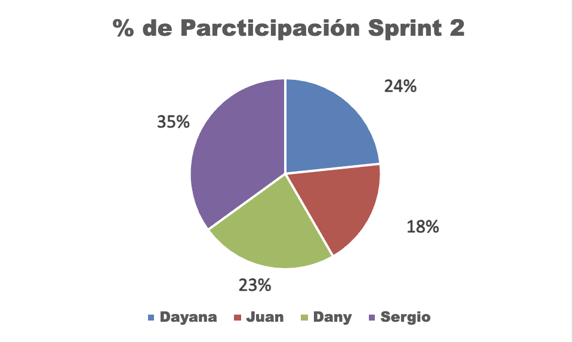

# Participación del equipo – Sprint 2

## Contexto

El Sprint 2 tuvo como objetivo avanzar en la documentación necesaria para la construcción
del MVP del sistema distribuido de E-Commerce Accesorios D&M.

Las actividades se dividieron en:

- Design Thinking Aplicado (50%)
- Priorización MoSCoW (30%)
- Repositorios (20%)

## Distribución del trabajo por actividades

### Design Thinking Aplicado (50%)

- Dayana, Juan y Dany:
  - Ejecución de fases (empatizar, definir, idear)
  - Documentación del mapa de empatía, Problem Statement y funcionalidades
- Sergio:
  - Organización y subida de la documentación al repositorio

### Priorización MoSCoW (30%)

- Todo el equipo:
  - Clasificación de funcionalidades (Must / Should / Could / Won’t)
- Dayana y Dany:
  - Creación y documentación de la tabla MoSCoW

### Repositorios (20%)

- Sergio:
  - Creación de repositorios para la arquitectura de microservicios
  - Configuración del README y convención de commits
  - Publicación de la tabla MoSCoW y Problem Statement

## Porcentaje de participación por integrante

| Integrante | Design Thinking | MoSCoW  | Repositorios | Participación Sprint 2 |
| ---------- | --------------- | ------- | ------------ | ---------------------- |
| Dayana     | 13.33%          | 10%     | 0%           | 23.33%                 |
| Juan       | 13.33%          | 5%      | 0%           | 18.33%                 |
| Dany       | 13.33%          | 10%     | 0%           | 23.33%                 |
| Sergio     | 10%             | 5%      | 20%          | 35%                    |
| **Total**  | **50%**         | **30%** | **20%**      | **100%**               |

